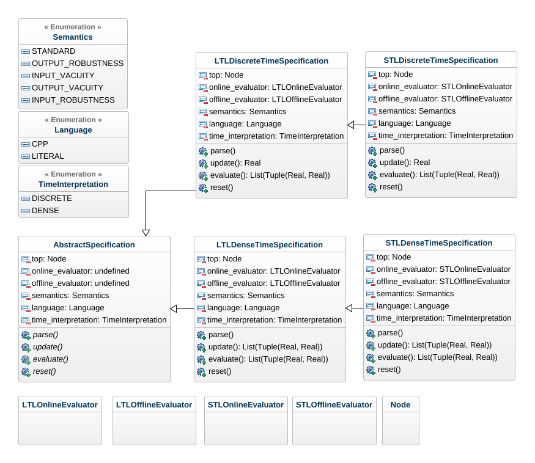

# How to implimnet a new temproal logic in RTAMT

This document explains the architecture of the library and provides guidelines 
for extending the library with (1) new operators, (2) existing syntax, 
but new semantics, and (3) alternative implementation of the existing algorithms.

## Overview of RTAMT architecture

### Top-level Architecture

The `AbstractSpecification` class as the main container class 
that also acts as the API between the user and the library. 
Concrete specifications are derived from this abstract class. Figure below 
depicts the most important attributes and methods of the class. 
The main attributes are:
- `top` – a pointer to a `Node` structure that encodes the parse-tree of the specification
- `offline_evaluator` – a pointer to an evaluator object that implements 
the offline evaluation (monitoring) algorithm
- `online_evaluator` - a pointer to an evaluator object that implements the 
online evaluation (monitoring) algorithm
- `semantics` – can be standard, output robustness, input vacuity, output vacuity 
and input robustness
- `time_interpretation` – can be discrete-time or dense-time
- `language` – implementation language of the monitoring algorithm, 
can be CPP or PYTHON

The main methods are:
- `parse()` – generates the parse tree of the specification from 
its textual description
- `update()` – does one monitoring step (evaluation) in the online monitor
- `evaluate()` – does the offline evaluation over the entire trace 
in the offline monitor
- `reset()` – resets the monitoring state of the monitor

The `AbstractSpecification` class does not implement these methods, but any 
derived class is expected to implement them (or throw a 
`NotImplemented` exception if a method is not meant to be implemented).

`LTLDiscreteTimeSpecification` is a class that is derived from 
`AbstractSpecification` and that is contains the implementation of 
discrete-time monitors for LTL. It provides a concrete implementation of 
`parse()`, `update()`, `evaluate()` and `reset()` methods. 

`STLDiscreteTimeSpecification` extends `LTLDiscreteTimeSpecification` 
with additional STL (timed) operators. 



### Node

[rtamt/node](rtamt/node)  


### Evaluator

[rtamt/evaluator](rtamt/evaluator)  


### grammar

[rtamt/grammar](rtamt/grammar)  
This contains lexser and paser setting based on [Antrl](https://www.antlr.org/).  

[rtamt/grammar/tl](rtamt/grammar/tl)  
expects to contain typical temporal logics.
So, we implimented [Linier Temporal Logic](https://en.wikipedia.org/wiki/Linear_temporal_logic) (LTL) in  
[LtlLexer.g4](rtamt/grammar/tl/LtlLexer.g4)  
[LtlParser.g4](rtamt/grammar/tl/LtlParser.g4)  
and Signal Temporal Logic (STL) in  
[StlLexer.g4](rtamt/grammar/tl/StlLexer.g4)  
[StlParser.g4](rtamt/grammar/tl/StlParser.g4)  
while importing LTL with

```g4
parser grammar StlParser ;
import LtlParser;
```

### parser

[rtamt/parser](rtamt/paser)  
This contains auto-generated parsers from Antrl based on the grammer.


### cpplib

[rtamt/cpplib](rtamt/cpplib)  
cpp version of nodes.

## How to impleiment new TL?

### Impliment syntax

You can designe your own syntax in [rtamt/paser](rtamt/paser).
If it is LTL or STL base, you can just use default our implimentation.

Then compile the grammer with antlr4

- python 2 case

    ```bash
    antlr4 StlParser.g4 -Dlanguage=Python2 -no-listener -visitor -o ../../parser/stl/python2/
    antlr4 StlLexer.g4 -Dlanguage=Python2 -no-listener -visitor -o ../../parser/stl/python2/
    ```

- python 3 case

    ```bash
    antlr4 StlParser.g4 -Dlanguage=Python3 -no-listener -visitor -o ../../parser/stl/python3/
    antlr4 StlLexer.g4 -Dlanguage=Python3 -no-listener -visitor -o ../../parser/stl/python3/
    ```

### Choose update and time handler

### Implement semantics

You can impliment your own semantics in [rtamt/node](rtamt/node).

### Test

You can make your own test case here.
